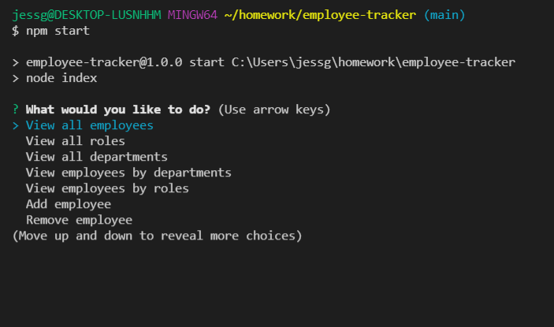
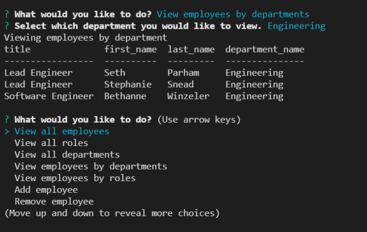

# employee-tracker
An application that allows the user to view, add, remove and update employees in a database. 


## Table of contents

- [Description](#description)
- [Demonstration](#demonstration)
- [Screenshots](#screenshots)
- [Installation](#installation)
- [Usage](#usage)
- [Tech](#tech)
- [Contributions](#contributions)
- [Github](#github)
- [Contact](#contact)
- [License](#license)


## Description

This application is a Node.js command-line application that prompts the user to select between many choices on what information from the database they would like to view. Specifically, this application allows the user to view all employees in the database along with their roles and departments. Additionally, one can easily add employees, roles, and departments along with the correlating information and it will become stored in the database. An employer can also remove an employee from the database as well as updating their role within the company. 

  

## Demonstration
[Click here for Demo](https://drive.google.com/file/d/1Ie8_PaI30G7Dp46bA2DAhc8lofcmZzA6/view)


## Screenshots





## Installation
This application requires the installment of 'inquirer', MYSQL, and console.table. Please run:
  ```
      npm i
  ```


## Usage
After the required dependencies are installed, open terminal and run the following command line and follow the prompts:

  ```
    npm start

  ```
    


## Tech

- VS Code
- Node.js
- MySQL

## Contributions

This project was made with help from:

* UNCC BootCamp class
* My tutor, Josh Furlin

## Github
Below is the link to the github repository for this project

<https://github.com/jessgreene9/employee-tracker>

## Contact

    
For any questions about this project, please visit my GitHub page: [GitHub Profile](https://github.com/jessgreene9)
      
Or email me at: [Jess Greene](mailto:jess.greene9@gmail.com)


## License

[](https://opensource.org/licenses/MIT)
  
  